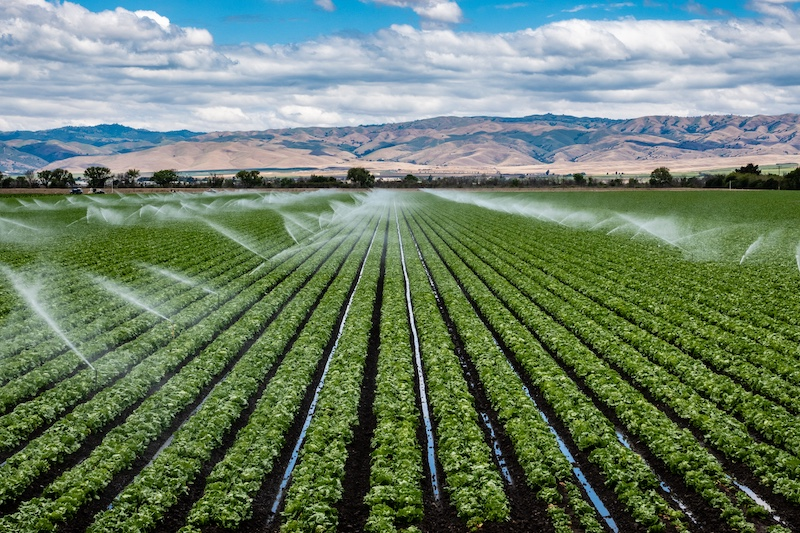

<!-- _class: title -->
<!-- _backgroundImage: url('../../bkg/FCBAi/Intro.png')-->

# Bay Area Visits for AgTech Young Startups
### A curated learning expedition for U.S. market entry, product validation, and ecosystem access

**Core idea:** **combine** **research**, **farmer exposure**, **startup benchmarks**, **and** **investor access**.

---

# Why the Bay Area works

## Research + applied insight
**UC Davis + Berkeley** give access to world-class agriculture, food systems, AI, and commercialization knowledge.

**Salinas + Central California** provide direct exposure to specialty crop production and real grower pain points.

## Startup relevance
**Silicon Valley** adds robotics, software, venture capital, and scaling know-how.

This combination is ideal for startups working on **precision ag, automation, climate, biotech, and data tools**.

> The goal is not tourism. It is rapid learning around **customer reality**, **technical relevance**, and **U.S. go-to-market fit**.

---

<!-- _backgroundImage: url('../../bkg/FCBAi/content/classic/Content_2col_classic.png') -->

# 1. UC Davis — the anchor visit

## Why visit
- Widely seen as the top U.S. university for agriculture and food systems
- Strong credibility for startups needing scientific context and validation
- Excellent bridge between academic research and commercial application

## What to do
- Meet faculty in **plant science, precision agriculture, irrigation, soil health, and climate-smart farming**
- Tour **greenhouses, field plots, vineyards, and pilot environments**
- Explore centers such as the **World Food Center** and related ag innovation programs

 

## Best outcome
Startups leave with a sharper understanding of **how U.S. growers think, measure, and adopt technology**.

---

# 2. Western Growers Center for Innovation & Technology

## Why visit Salinas
- One of the strongest U.S. hubs for **specialty crop AgTech**
- Direct line to growers, shippers, and real commercial pilots
- Strong focus on labor, automation, and operational pain points

## What startups gain
- Exposure to **harvest robotics, sensing, irrigation, crop operations, and field automation**
- Introductions to potential customers, not just ecosystem intermediaries
- A better sense of whether their product fits the realities of **high-value produce production**

## Best outcome
A reality check on **who pays, why they pay, and what must work in the field**.

---

<!-- _backgroundImage: url('../../bkg/FCBAi/content/classic/Content_2col_classic.png') -->

# 3. Silicon Valley robotics and AI applied to agriculture

## Suggested company targets
- **FarmWise** — AI and computer-vision weeding systems
- **Bear Flag Robotics / John Deere** — autonomous tractor capabilities
- **Plenty** — controlled-environment and indoor farming models

## What to focus on
- Replacing or augmenting scarce labor
- Computer vision for decision support and actuation
- Full-stack product design: hardware, software, operations, data
- Unit economics: where automation really creates value

## Best outcome
Founders see how **deep tech becomes an agricultural product**, not just a demo.

---

# 4. Investor and ecosystem meetings

## Priority organizations
- **SVG Ventures / THRIVE**
- **AgFunder**

## Suggested format
- One closed-door **pitch and feedback session**
- One ecosystem roundtable on **U.S. entry strategy**
- Optional founder dinner with operators, alumni, or angels

## Questions startups should test
- Is the problem urgent enough in the U.S. market?
- Is the buyer a grower, agribusiness, input company, or channel partner?
- What level of traction is needed before U.S. fundraising makes sense?

## Best outcome
Clearer understanding of **what gets funded** and what gets ignored.

---

# 5. Real farm visits — essential, not optional

## Recommended geographies
- **Salinas Valley** — vegetables and specialty crops
- **Napa / Sonoma** — vineyards and premium crop management
- **Central Valley** — large-scale nuts, fruit, irrigation, and mechanization

## Why these visits matter
U.S. agriculture at scale often looks very different from what early startups expect.

## Typical pain points to observe
- Labor shortages
- Water constraints and irrigation efficiency
- Compliance and food safety requirements
- Reliability under real field conditions
- Integration with existing workflows and equipment

> Farm visits often create the biggest shift in thinking: from “interesting technology” to “deployable solution.”

---

# 6. Climate and food innovation layer

## Suggested themes and examples
- **Pivot Bio** — biological nitrogen alternatives and crop nutrition
- **Indigo Ag** *(if accessible through network meetings)* — sustainability, carbon, and agronomic platforms
- Food innovation and climate-adjacent companies working on inputs, resilience, and resource efficiency

## Why include this layer
- Opens the door to **climate positioning** for agricultural startups
- Helps founders speak the language of **sustainability, resilience, and emissions reduction**
- Expands beyond machinery into **biology, inputs, and ecosystem services**

## Best outcome
A stronger narrative around **agriculture as climate infrastructure**.

---

# 7. UC Berkeley — the AI and business model layer

## Why Berkeley adds value
- Strong ecosystem around **AI, data science, entrepreneurship, and commercialization**
- Useful for startups building software, decision tools, and analytics layers
- Good place to discuss business models, platform strategy, and scaling logic

## What to do
- Host a workshop on **AI for agriculture**
- Meet startup operators, faculty, or students working on data-intensive ventures
- Run founder sessions on **go-to-market, product focus, and pricing**

## Best outcome
Founders connect agricultural use cases with **software leverage, data strategy, and scalable business design**.

---

# 3–5 day program

| Day | Focus | Example activities |
|---|---|---|
| **1** | Berkeley | AI, data, business-model workshops |
| **2** | Silicon Valley | Startup visits + investor meetings |
| **3** | UC Davis | Research labs, field plots, applied science |
| **4** | Salinas | Western Growers + grower / farm visits |
| **5** | Optional | Climate, biotech, food tech, follow-up meetings |

## Design principle
Move from **strategy → technology → science → customers → market fit**.

---

# What each startup should leave with

## Market insight
- Which U.S. segment they actually serve
- Which pain point is strongest and most monetizable

## Product insight
- What must change for U.S. deployment
- Whether the product is a feature, a workflow tool, or a category company

## Partnership insight
- Which pilots, distributors, or research partners matter most
- Who can sponsor validation or first deployments

## Fundraising insight
- Whether they are ready for U.S. capital conversations now or later

---

# In advance preparation
## Each startup to arrive with:
- a 1-slide product summary
- 3 target customer hypotheses
- 3 questions for growers
- 3 questions for investors

## Follow up afterward
Turn visits into outcomes:
- pilot pipeline
- partner introductions
- revised U.S. entry plan
- investor follow-up list

---

# Sources

- UC Davis World Food Center: https://worldfoodcenter.ucdavis.edu/  
- Western Growers Center for Innovation & Technology: https://wginnovation.com/  
- SVG Ventures / THRIVE: https://svgventures.com/thrive-platform/  
- AgFunder: https://agfunder.com/  
- FarmWise: https://farmwise.io/  
- Bear Flag Robotics / John Deere: https://bearflagrobotics.com/  
- Plenty: https://www.plenty.ag/  
- Pivot Bio: https://www.pivotbio.com/  

