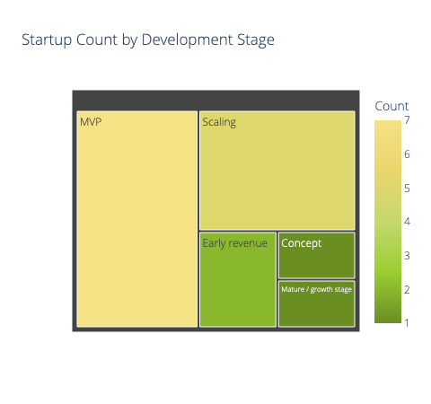
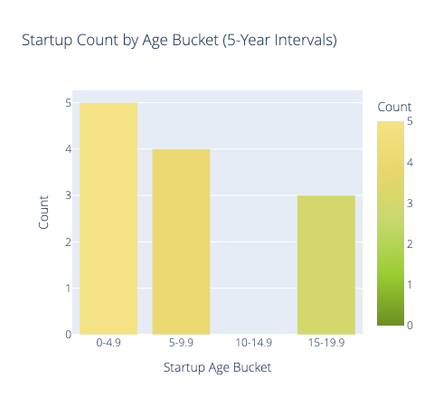
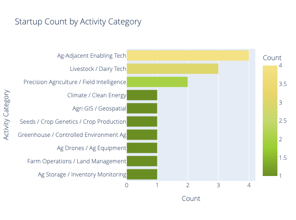
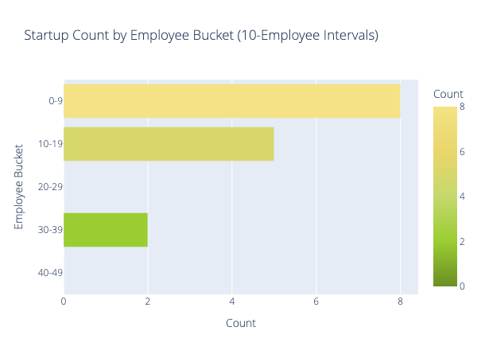
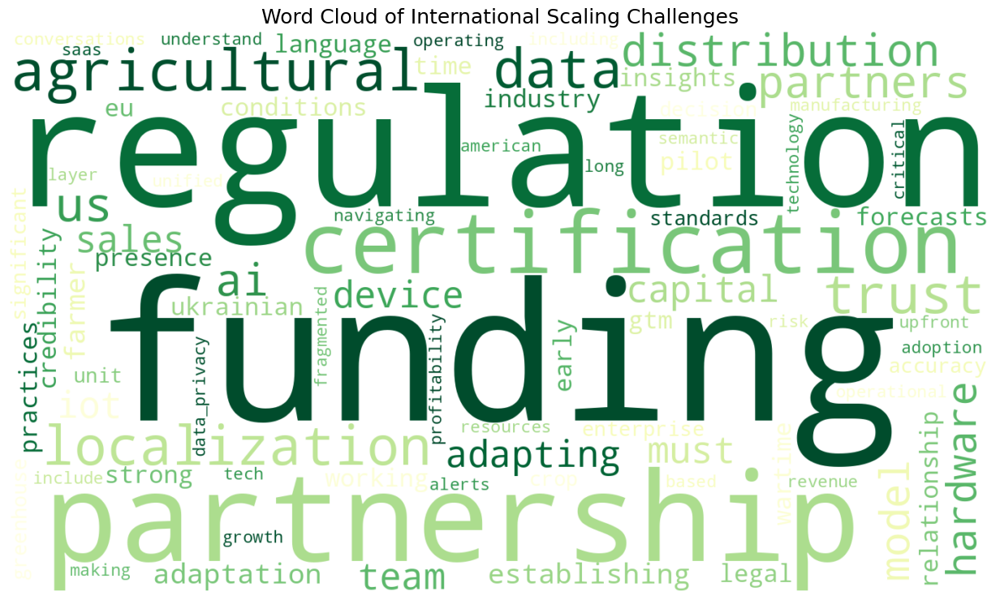
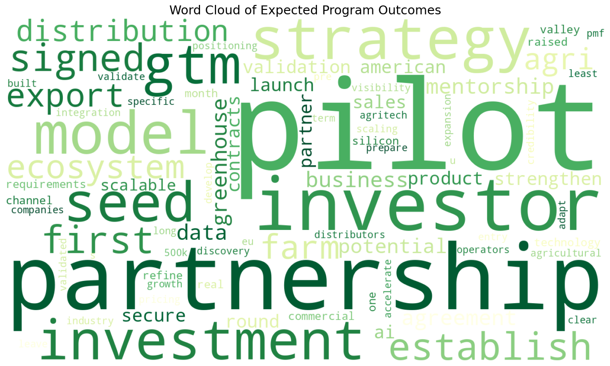

<!-- _class: title -->
<!-- _backgroundImage: url('../../bkg/FCBAi/Intro.png')-->

# Startup Profiles
## Agro Accelerator Cohort 2026

---

<!-- _backgroundImage: url('../../bkg/FCBAi/headers/Header2.png')-->

#### Startup List

---

<!-- _backgroundImage: url('../../bkg/FCBAi/content/classic/Content_Classic.png') -->

| Startup        | Website                                                                                | Activity Category                          | Notes                                                   |
| -------------- | -------------------------------------------------------------------------------------- | ------------------------------------------ | ------------------------------------------------------- |
| HEFT           | [https://heft.systems/](https://heft.systems/)                                         | Livestock / Dairy Tech                     | AI herd health and fertility monitoring                 |
| Raymetra       | [https://raymetra.pro/](https://raymetra.pro/)                                         | Ag Storage / Inventory Monitoring          | LiDAR and 3D monitoring for silos and warehouses        |
| YHarvest       | [https://yharvest.io](https://yharvest.io)                                             | Precision Agriculture / Field Intelligence | AI solutions for precision agriculture                  |
| artAXE         | [http://artaxe-studio.com/](http://artaxe-studio.com/)                                 | Ag-Adjacent Enabling Tech                  | IoT, firmware, hardware, and prototyping                |
| Feodal         | [https://feodal.online/](https://feodal.online/)                                       | Farm Operations / Land Management          | Platform for farmers, landowners, communities, demining |
| HowCow         | [https://howcow.tech](https://howcow.tech)                                             | Livestock / Dairy Tech                     | Likely cattle/dairy related; verify if needed           |
| Innoneers      | [https://innoneers.com](https://innoneers.com)                                         | Ag-Adjacent Enabling Tech                  | Engineering and intelligent software development        |
| Agronix        | [https://agronix.ua/](https://agronix.ua/)                                             | Ag Drones / Ag Equipment                   | DJI Agriculture drones, training, equipment services    |
| VALVIX.AI      | [https://valvix.ai](https://valvix.ai)                                                 | Greenhouse / Controlled Environment Ag     | Smart greenhouse automation                             |
| PROFEED Mix    | [https://profeed.systems/mix/](https://profeed.systems/mix/)                           | Livestock / Dairy Tech                     | Dairy farm software and feed management                 |
| SAFIS.AI       | [https://www.linkedin.com/company/safis-ai](https://www.linkedin.com/company/safis-ai) | Precision Agriculture / Field Intelligence | Soil and crop monitoring with IoT and AI                |
| Agrico Ukraine | [https://www.agrico.com.ua](https://www.agrico.com.ua)                                 | Seeds / Crop Genetics / Crop Production    | Seed and table potatoes                                 |
| b2beings       | [https://b2beings.com](https://b2beings.com)                                           | Ag-Adjacent Enabling Tech                  | B2B SaaS product development                            |
| GIS-Point      | [https://gis-point.com](https://gis-point.com)                                         | Agri GIS / Geospatial                      | GIS, IoT, and AI for agriculture                        |
| Almexoft       | [https://almexoft.com.ua/](https://almexoft.com.ua/)                                   | Ag-Adjacent Enabling Tech                  | Document management and workflow software               |
| Sirocco Energy | [https://www.siroccoenergy.com](https://www.siroccoenergy.com)                         | Climate / Clean Energy                     | Wind energy solutions                                   |

---

<!-- _backgroundImage: url('../../bkg/FCBAi/headers/Header2.png')-->

#### Startup Background

---

# Cohort Stages

---

# Cohort Age

---

# Cohort Categories

---

# Cohort Categories

---

<!-- _backgroundImage: url('../../bkg/FCBAi/headers/Header2.png')-->

#### Challenges

---

###### The cohort is not mainly blocked by product ideas, but by the friction of cross-border scaling. The strongest recurring barriers are partnerships, financing, regulatory/certification hurdles, localization, trust-building, and the operational complexity of entering new markets.

---

---

<!-- _backgroundImage: url('../../bkg/FCBAi/headers/Header2.png')-->

#### Expectations

---

Across the cohort, the main ask is clear: startups do not want a generic exposure trip. They want a **market-entry acceleration program** that helps them turn interest into pilots, partnerships, and investor traction. The repeated outcomes are U.S. market validation, pilot launches, channel or distribution partnerships, investor introductions, GTM refinement, and help with regulatory or operational readiness. 

---

---

<!-- _class: small -->
<!-- _backgroundImage: url('bkg/FCBAi/content/classic/Content_2col_classic.png') -->

# The Main Asks

### 1. Market validation
**Structured access to U.S**. growers, greenhouse operators, agri-holdings, distributors, and advisors to test fit, refine messaging, and validate demand.

### 2. Pilots and first traction
**Support to secure pilot projects**, demo sites, and first commercial footholds — especially with dairy farms, greenhouse operators, and early U.S. users.

### 3. Partnerships
**Warm introductions** to distributors, dealers, integrators, machinery players, banks, insurers, and technology partners to accelerate market access.

### 4. Investor access
**Qualified investor introductions**, stronger pitch materials, and better fundraising readiness for pre-seed and seed rounds.

### 5. GTM and export roadmap
**Guidance** on ICP, pricing, channel strategy, support model, export planning, and international sales execution.

### 6. Regulatory readiness
**Practical help** on certification, compliance, FCC-type requirements, and other U.S. market-entry constraints.

### 7. Product adaptation
**Mentorship** to adapt AI models, product design, and architecture to U.S. crops, climate, infrastructure, and buyer expectations.

### 8. Credibility and follow-up
**A trusted Berkeley bridge** into the ecosystem, plus continued mentorship beyond the immersion to convert momentum into results.

---

<!-- 

1. **U.S. Ag market intelligence and customer discovery**
2. **Pilot design and pilot negotiation support**
3. **Partner matching: distributors, integrators, growers, ecosystem players**
4. **Investor readiness, storytelling, and curated investor meetings**
5. **GTM, pricing, and export roadmap workshops**
6. **Regulatory/compliance office hours**
7. **Technical adaptation and product feedback sessions**
8. **Post-program mentorship with milestone tracking**

-->

<!-- _backgroundImage: url('../../bkg/FCBAi/Closer.png')-->

