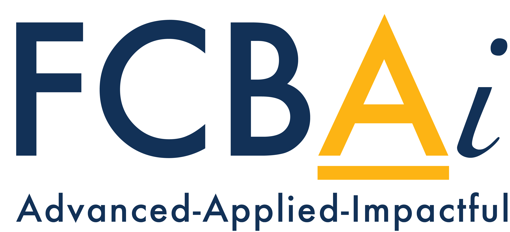

 
 

| first_name | last_name | contact_info | organization | title | profile_link | link_confidence | link_type | personalized_outreach_message |
| --- | --- | --- | --- | --- | --- | --- | --- | --- |
| Feroz | Sheikh |  | SYNGENTA GROUP | CIO & CDO | https://ch.linkedin.com/in/sferoz | high | LinkedIn | Dear Feroz, I hope you are doing well. My name is Gauthier Vasseur, and I am the Program Director of a training initiative organized through the U.S. Department of State and UC Berkeley’s Berkeley Institute for Business Innovation at the Haas School of Business. We are bringing together 20 Ukrainian agricultural startups that are eager to expand into the U.S. and international markets, meet partners, clients, investors, and technologists, and learn from leaders with real field and market experience. Given your role as CIO & CDO at SYNGENTA GROUP, I believe you could bring exceptional value by speaking about how digital transformation, data, and product design can help agtech startups scale more effectively in the U.S. market. We offer a $1,500 honorarium for each 90-minute session. I would be delighted to explore whether you might be open to joining us as a speaker. Please do not hesitate to reach out to me directly at gauthier.vasseur@berkeley.edu. Thank you very much for considering it. |
| Roy | Steiner |  | THE ROCKEFELLER FOUNDATION | SVP, Food | https://www.linkedin.com/in/drsteiner | high | LinkedIn | Dear Roy, I hope you are doing well. My name is Gauthier Vasseur, and I am the Program Director of a training initiative organized through the U.S. Department of State and UC Berkeley’s Berkeley Institute for Business Innovation at the Haas School of Business. We are bringing together 20 Ukrainian agricultural startups that are eager to expand into the U.S. and international markets, meet partners, clients, investors, and technologists, and learn from leaders with real field and market experience. Given your role as SVP, Food at THE ROCKEFELLER FOUNDATION, I believe you could bring exceptional value by speaking about the practical realities of entering the U.S. market, building partnerships, and creating commercial momentum for agricultural startups. We offer a $1,500 honorarium for each 90-minute session. I would be delighted to explore whether you might be open to joining us as a speaker. Please do not hesitate to reach out to me directly at gauthier.vasseur@berkeley.edu. Thank you very much for considering it. |
| Ashley | Stokes |  | UC DAVIS | Dean, College of Agricultural and Environmental Sciences | https://www.linkedin.com/in/stokes-ashley-dvm-phd-mba | high | LinkedIn | Dear Ashley, I hope you are doing well. My name is Gauthier Vasseur, and I am the Program Director of a training initiative organized through the U.S. Department of State and UC Berkeley’s Berkeley Institute for Business Innovation at the Haas School of Business. We are bringing together 20 Ukrainian agricultural startups that are eager to expand into the U.S. and international markets, meet partners, clients, investors, and technologists, and learn from leaders with real field and market experience. Given your role as Dean, College of Agricultural and Environmental Sciences at UC DAVIS, I believe you could bring exceptional value by speaking about how research, science, and innovation can translate into practical value for agricultural startups entering new markets. We offer a $1,500 honorarium for each 90-minute session. I would be delighted to explore whether you might be open to joining us as a speaker. Please do not hesitate to reach out to me directly at gauthier.vasseur@berkeley.edu. Thank you very much for considering it. |
| Kip | Tom |  |  | FARMER AND FORMER U.S. AMBASSADOR | https://www.linkedin.com/in/kip-tom-78941b37 | high | LinkedIn | Dear Kip, I hope you are doing well. My name is Gauthier Vasseur, and I am the Program Director of a training initiative organized through the U.S. Department of State and UC Berkeley’s Berkeley Institute for Business Innovation at the Haas School of Business. We are bringing together 20 Ukrainian agricultural startups that are eager to expand into the U.S. and international markets, meet partners, clients, investors, and technologists, and learn from leaders with real field and market experience. Given your role as FARMER AND FORMER U.S. AMBASSADOR, I believe you could bring exceptional value by speaking about what growers and operators really need from agtech, what makes a pilot useful in practice, and how startups can build trust with real agricultural customers. We offer a $1,500 honorarium for each 90-minute session. I would be delighted to explore whether you might be open to joining us as a speaker. Please do not hesitate to reach out to me directly at gauthier.vasseur@berkeley.edu. Thank you very much for considering it. |
| Jim | Jones |  | AGRIBANK | Chief Credit Officer | https://www.linkedin.com/in/jim-jones-74b75831 | high | LinkedIn | Dear Jim, I hope you are doing well. My name is Gauthier Vasseur, and I am the Program Director of a training initiative organized through the U.S. Department of State and UC Berkeley’s Berkeley Institute for Business Innovation at the Haas School of Business. We are bringing together 20 Ukrainian agricultural startups that are eager to expand into the U.S. and international markets, meet partners, clients, investors, and technologists, and learn from leaders with real field and market experience. Given your role as Chief Credit Officer at AGRIBANK, I believe you could bring exceptional value by speaking about how financial institutions assess agricultural businesses and what startups should understand about risk, financing, and market credibility. We offer a $1,500 honorarium for each 90-minute session. I would be delighted to explore whether you might be open to joining us as a speaker. Please do not hesitate to reach out to me directly at gauthier.vasseur@berkeley.edu. Thank you very much for considering it. |
| Vishnu | Jayaprakash |  | AGZEN | Co-Founder and CEO | https://www.linkedin.com/in/vishnu-jayaprakash | high | LinkedIn | Dear Vishnu, I hope you are doing well. My name is Gauthier Vasseur, and I am the Program Director of a training initiative organized through the U.S. Department of State and UC Berkeley’s Berkeley Institute for Business Innovation at the Haas School of Business. We are bringing together 20 Ukrainian agricultural startups that are eager to expand into the U.S. and international markets, meet partners, clients, investors, and technologists, and learn from leaders with real field and market experience. Given your role as Co-Founder and CEO at AGZEN, I believe you could bring exceptional value by speaking about the practical lessons of building and scaling an agtech company, especially around partnerships, pilots, and market entry. We offer a $1,500 honorarium for each 90-minute session. I would be delighted to explore whether you might be open to joining us as a speaker. Please do not hesitate to reach out to me directly at gauthier.vasseur@berkeley.edu. Thank you very much for considering it. |
| Jessica | Wedow |  | AIFARMS | Executive Director | https://www.linkedin.com/in/jessica-wedow-829b245b | medium | LinkedIn | Dear Jessica, I hope you are doing well. My name is Gauthier Vasseur, and I am the Program Director of a training initiative organized through the U.S. Department of State and UC Berkeley’s Berkeley Institute for Business Innovation at the Haas School of Business. We are bringing together 20 Ukrainian agricultural startups that are eager to expand into the U.S. and international markets, meet partners, clients, investors, and technologists, and learn from leaders with real field and market experience. Given your role as Executive Director at AIFARMS, I believe you could bring exceptional value by speaking about how startups can better connect with the ag innovation ecosystem, potential partners, and commercialization opportunities. We offer a $1,500 honorarium for each 90-minute session. I would be delighted to explore whether you might be open to joining us as a speaker. Please do not hesitate to reach out to me directly at gauthier.vasseur@berkeley.edu. Thank you very much for considering it. |
| Marcela | Quintero |  | ALLIANCE OF BIOVERSITY INTERNATIONAL AND THE INTERNATIONAL CENTER FOR TROPICAL AGRICULTURE (CIAT) | Associate Director General, Research Strategy and Innovation | https://co.linkedin.com/in/marcela-quintero-2a483146 | high | LinkedIn | Dear Marcela, I hope you are doing well. My name is Gauthier Vasseur, and I am the Program Director of a training initiative organized through the U.S. Department of State and UC Berkeley’s Berkeley Institute for Business Innovation at the Haas School of Business. We are bringing together 20 Ukrainian agricultural startups that are eager to expand into the U.S. and international markets, meet partners, clients, investors, and technologists, and learn from leaders with real field and market experience. Given your role as Associate Director General, Research Strategy and Innovation at ALLIANCE OF BIOVERSITY INTERNATIONAL AND THE INTERNATIONAL CENTER FOR TROPICAL AGRICULTURE (CIAT), I believe you could bring exceptional value by speaking about how research, science, and innovation can translate into practical value for agricultural startups entering new markets. We offer a $1,500 honorarium for each 90-minute session. I would be delighted to explore whether you might be open to joining us as a speaker. Please do not hesitate to reach out to me directly at gauthier.vasseur@berkeley.edu. Thank you very much for considering it. |
| Adam | Anders |  | ANTERRA CAPITAL | Managing Partner | https://nl.linkedin.com/in/adamanders | high | LinkedIn | Dear Adam, I hope you are doing well. My name is Gauthier Vasseur, and I am the Program Director of a training initiative organized through the U.S. Department of State and UC Berkeley’s Berkeley Institute for Business Innovation at the Haas School of Business. We are bringing together 20 Ukrainian agricultural startups that are eager to expand into the U.S. and international markets, meet partners, clients, investors, and technologists, and learn from leaders with real field and market experience. Given your role as Managing Partner at ANTERRA CAPITAL, I believe you could bring exceptional value by speaking about what makes an agtech company investable, how founders can position themselves for U.S. and international investors, and what you look for in early commercial traction. We offer a $1,500 honorarium for each 90-minute session. I would be delighted to explore whether you might be open to joining us as a speaker. Please do not hesitate to reach out to me directly at gauthier.vasseur@berkeley.edu. Thank you very much for considering it. |
| Mika | Eberl |  | BASF | Head of AgroStart, AI Lead and Digital Officer, Agricultural Solutions | https://www.linkedin.com/in/mika-eberl | medium | LinkedIn | Dear Mika, I hope you are doing well. My name is Gauthier Vasseur, and I am the Program Director of a training initiative organized through the U.S. Department of State and UC Berkeley’s Berkeley Institute for Business Innovation at the Haas School of Business. We are bringing together 20 Ukrainian agricultural startups that are eager to expand into the U.S. and international markets, meet partners, clients, investors, and technologists, and learn from leaders with real field and market experience. Given your role as Head of AgroStart, AI Lead and Digital Officer, Agricultural Solutions at BASF, I believe you could bring exceptional value by speaking about how digital transformation, data, and product design can help agtech startups scale more effectively in the U.S. market. We offer a $1,500 honorarium for each 90-minute session. I would be delighted to explore whether you might be open to joining us as a speaker. Please do not hesitate to reach out to me directly at gauthier.vasseur@berkeley.edu. Thank you very much for considering it. |

| first_name | last_name | contact_info | organization | title | profile_link | link_confidence | link_type | personalized_outreach_message |
| --- | --- | --- | --- | --- | --- | --- | --- | --- |
| Matthias | Berninger |  | BAYER | EVP Public Affairs, Science, Sustainability | https://de.linkedin.com/in/matthias-berninger | high | LinkedIn | Dear Matthias, I hope you are doing well. My name is Gauthier Vasseur, and I am the Program Director of a training initiative organized through the U.S. Department of State and UC Berkeley’s Berkeley Institute for Business Innovation at the Haas School of Business. We are bringing together 20 Ukrainian agricultural startups that are eager to expand into the U.S. and international markets, meet partners, clients, investors, and technologists, and learn from leaders with real field and market experience. Given your role as EVP Public Affairs, Science, Sustainability at BAYER, I believe you could bring exceptional value by speaking about how research, science, and innovation can translate into practical value for agricultural startups entering new markets. We offer a $1,500 honorarium for each 90-minute session. I would be delighted to explore whether you might be open to joining us as a speaker. Please do not hesitate to reach out to me directly at gauthier.vasseur@berkeley.edu. Thank you very much for considering it. |
| Sarah | Federman |  | CARBON DIRECT | VP of Landscape Decarbonization | https://www.linkedin.com/in/sarah-federman | high | LinkedIn | Dear Sarah, I hope you are doing well. My name is Gauthier Vasseur, and I am the Program Director of a training initiative organized through the U.S. Department of State and UC Berkeley’s Berkeley Institute for Business Innovation at the Haas School of Business. We are bringing together 20 Ukrainian agricultural startups that are eager to expand into the U.S. and international markets, meet partners, clients, investors, and technologists, and learn from leaders with real field and market experience. Given your role as VP of Landscape Decarbonization at CARBON DIRECT, I believe you could bring exceptional value by speaking about how climate and sustainability priorities are shaping agricultural innovation, partnerships, and commercial opportunities. We offer a $1,500 honorarium for each 90-minute session. I would be delighted to explore whether you might be open to joining us as a speaker. Please do not hesitate to reach out to me directly at gauthier.vasseur@berkeley.edu. Thank you very much for considering it. |
| Howard-Yana | Shapiro |  | CIFOR-ICRAF | Distinguished Senior Fellow | https://www.linkedin.com/in/howard-yana-shapiro-3843287 | medium | LinkedIn | Dear Howard-Yana, I hope you are doing well. My name is Gauthier Vasseur, and I am the Program Director of a training initiative organized through the U.S. Department of State and UC Berkeley’s Berkeley Institute for Business Innovation at the Haas School of Business. We are bringing together 20 Ukrainian agricultural startups that are eager to expand into the U.S. and international markets, meet partners, clients, investors, and technologists, and learn from leaders with real field and market experience. Given your role as Distinguished Senior Fellow at CIFOR-ICRAF, I believe you could bring exceptional value by speaking about how research, science, and innovation can translate into practical value for agricultural startups entering new markets. We offer a $1,500 honorarium for each 90-minute session. I would be delighted to explore whether you might be open to joining us as a speaker. Please do not hesitate to reach out to me directly at gauthier.vasseur@berkeley.edu. Thank you very much for considering it. |
| Lisa | Jackson |  | CNH | VP of UX & Design | https://www.linkedin.com/in/lisajackson2015 | high | LinkedIn | Dear Lisa, I hope you are doing well. My name is Gauthier Vasseur, and I am the Program Director of a training initiative organized through the U.S. Department of State and UC Berkeley’s Berkeley Institute for Business Innovation at the Haas School of Business. We are bringing together 20 Ukrainian agricultural startups that are eager to expand into the U.S. and international markets, meet partners, clients, investors, and technologists, and learn from leaders with real field and market experience. Given your role as VP of UX & Design at CNH, I believe you could bring exceptional value by speaking about how digital transformation, data, and product design can help agtech startups scale more effectively in the U.S. market. We offer a $1,500 honorarium for each 90-minute session. I would be delighted to explore whether you might be open to joining us as a speaker. Please do not hesitate to reach out to me directly at gauthier.vasseur@berkeley.edu. Thank you very much for considering it. |
| Brenda | Frank |  | COBANK | Chief Transformation Officer | https://www.linkedin.com/in/brenda-frank-c-dir-mba-861b899 | high | LinkedIn | Dear Brenda, I hope you are doing well. My name is Gauthier Vasseur, and I am the Program Director of a training initiative organized through the U.S. Department of State and UC Berkeley’s Berkeley Institute for Business Innovation at the Haas School of Business. We are bringing together 20 Ukrainian agricultural startups that are eager to expand into the U.S. and international markets, meet partners, clients, investors, and technologists, and learn from leaders with real field and market experience. Given your role as Chief Transformation Officer at COBANK, I believe you could bring exceptional value by speaking about how digital transformation, data, and product design can help agtech startups scale more effectively in the U.S. market. We offer a $1,500 honorarium for each 90-minute session. I would be delighted to explore whether you might be open to joining us as a speaker. Please do not hesitate to reach out to me directly at gauthier.vasseur@berkeley.edu. Thank you very much for considering it. |
| Reza | Rasoulpour |  | CORTEVA AGRISCIENCE | Global Vice President of Regulatory and Stewardship | https://www.openinnovation.corteva.com/innovation-stories/meet-our-scientists-reza-rasoulpour.html | medium | Best public link | Dear Reza, I hope you are doing well. My name is Gauthier Vasseur, and I am the Program Director of a training initiative organized through the U.S. Department of State and UC Berkeley’s Berkeley Institute for Business Innovation at the Haas School of Business. We are bringing together 20 Ukrainian agricultural startups that are eager to expand into the U.S. and international markets, meet partners, clients, investors, and technologists, and learn from leaders with real field and market experience. Given your role as Global Vice President of Regulatory and Stewardship at CORTEVA AGRISCIENCE, I believe you could bring exceptional value by speaking about how research, science, and innovation can translate into practical value for agricultural startups entering new markets. We offer a $1,500 honorarium for each 90-minute session. I would be delighted to explore whether you might be open to joining us as a speaker. Please do not hesitate to reach out to me directly at gauthier.vasseur@berkeley.edu. Thank you very much for considering it. |
| Wendy | Srinc |  | CORTEVA AGRISCIENCE | Vice President, Biotechnology | https://www.linkedin.com/in/wendy-pline-srnic | high | LinkedIn | Dear Wendy, I hope you are doing well. My name is Gauthier Vasseur, and I am the Program Director of a training initiative organized through the U.S. Department of State and UC Berkeley’s Berkeley Institute for Business Innovation at the Haas School of Business. We are bringing together 20 Ukrainian agricultural startups that are eager to expand into the U.S. and international markets, meet partners, clients, investors, and technologists, and learn from leaders with real field and market experience. Given your role as Vice President, Biotechnology at CORTEVA AGRISCIENCE, I believe you could bring exceptional value by speaking about how research, science, and innovation can translate into practical value for agricultural startups entering new markets. We offer a $1,500 honorarium for each 90-minute session. I would be delighted to explore whether you might be open to joining us as a speaker. Please do not hesitate to reach out to me directly at gauthier.vasseur@berkeley.edu. Thank you very much for considering it. |
| Siva | Avvaru |  | CORVIAN | Managing Director, Enterprise Growth | https://www.linkedin.com/in/sivaavvaru | high | LinkedIn | Dear Siva, I hope you are doing well. My name is Gauthier Vasseur, and I am the Program Director of a training initiative organized through the U.S. Department of State and UC Berkeley’s Berkeley Institute for Business Innovation at the Haas School of Business. We are bringing together 20 Ukrainian agricultural startups that are eager to expand into the U.S. and international markets, meet partners, clients, investors, and technologists, and learn from leaders with real field and market experience. Given your role as Managing Director, Enterprise Growth at CORVIAN, I believe you could bring exceptional value by speaking about how startups can better connect with the ag innovation ecosystem, potential partners, and commercialization opportunities. We offer a $1,500 honorarium for each 90-minute session. I would be delighted to explore whether you might be open to joining us as a speaker. Please do not hesitate to reach out to me directly at gauthier.vasseur@berkeley.edu. Thank you very much for considering it. |
| Seana | Day |  | DAVE WILSON NURSERY | CEO and Board Chair | https://www.linkedin.com/in/seanadayhull | high | LinkedIn | Dear Seana, I hope you are doing well. My name is Gauthier Vasseur, and I am the Program Director of a training initiative organized through the U.S. Department of State and UC Berkeley’s Berkeley Institute for Business Innovation at the Haas School of Business. We are bringing together 20 Ukrainian agricultural startups that are eager to expand into the U.S. and international markets, meet partners, clients, investors, and technologists, and learn from leaders with real field and market experience. Given your role as CEO and Board Chair at DAVE WILSON NURSERY, I believe you could bring exceptional value by speaking about what growers and operators really need from agtech, what makes a pilot useful in practice, and how startups can build trust with real agricultural customers. We offer a $1,500 honorarium for each 90-minute session. I would be delighted to explore whether you might be open to joining us as a speaker. Please do not hesitate to reach out to me directly at gauthier.vasseur@berkeley.edu. Thank you very much for considering it. |
| Joe | Del Bosque |  | DEL BOSQUE FARMS | Farmer | https://www.linkedin.com/in/joe-del-bosque-03797bb7 | high | LinkedIn | Dear Joe, I hope you are doing well. My name is Gauthier Vasseur, and I am the Program Director of a training initiative organized through the U.S. Department of State and UC Berkeley’s Berkeley Institute for Business Innovation at the Haas School of Business. We are bringing together 20 Ukrainian agricultural startups that are eager to expand into the U.S. and international markets, meet partners, clients, investors, and technologists, and learn from leaders with real field and market experience. Given your role as Farmer at DEL BOSQUE FARMS, I believe you could bring exceptional value by speaking about what growers and operators really need from agtech, what makes a pilot useful in practice, and how startups can build trust with real agricultural customers. We offer a $1,500 honorarium for each 90-minute session. I would be delighted to explore whether you might be open to joining us as a speaker. Please do not hesitate to reach out to me directly at gauthier.vasseur@berkeley.edu. Thank you very much for considering it. |

| first_name | last_name | contact_info | organization | title | profile_link | link_confidence | link_type | personalized_outreach_message |
| --- | --- | --- | --- | --- | --- | --- | --- | --- |
| Andrew | Pylypchuk |  | EARTHDAILY | Global Director, Agriculture | https://ca.linkedin.com/in/andrewpylypchuk | high | LinkedIn | Dear Andrew, I hope you are doing well. My name is Gauthier Vasseur, and I am the Program Director of a training initiative organized through the U.S. Department of State and UC Berkeley’s Berkeley Institute for Business Innovation at the Haas School of Business. We are bringing together 20 Ukrainian agricultural startups that are eager to expand into the U.S. and international markets, meet partners, clients, investors, and technologists, and learn from leaders with real field and market experience. Given your role as Global Director, Agriculture at EARTHDAILY, I believe you could bring exceptional value by speaking about how startups can better connect with the ag innovation ecosystem, potential partners, and commercialization opportunities. We offer a $1,500 honorarium for each 90-minute session. I would be delighted to explore whether you might be open to joining us as a speaker. Please do not hesitate to reach out to me directly at gauthier.vasseur@berkeley.edu. Thank you very much for considering it. |
| Clay | Mitchell |  | FALL LINE CAPITAL | Farmer, Co-Founder and Managing Director | https://www.linkedin.com/in/clay-mitchell-4b66b34 | high | LinkedIn | Dear Clay, I hope you are doing well. My name is Gauthier Vasseur, and I am the Program Director of a training initiative organized through the U.S. Department of State and UC Berkeley’s Berkeley Institute for Business Innovation at the Haas School of Business. We are bringing together 20 Ukrainian agricultural startups that are eager to expand into the U.S. and international markets, meet partners, clients, investors, and technologists, and learn from leaders with real field and market experience. Given your role as Farmer, Co-Founder and Managing Director at FALL LINE CAPITAL, I believe you could bring exceptional value by speaking about what makes an agtech company investable, how founders can position themselves for U.S. and international investors, and what you look for in early commercial traction. We offer a $1,500 honorarium for each 90-minute session. I would be delighted to explore whether you might be open to joining us as a speaker. Please do not hesitate to reach out to me directly at gauthier.vasseur@berkeley.edu. Thank you very much for considering it. |
| Christy | Seyfert |  | FARM CREDIT COUNCIL | President & CEO | https://www.linkedin.com/in/christyseyfert | high | LinkedIn | Dear Christy, I hope you are doing well. My name is Gauthier Vasseur, and I am the Program Director of a training initiative organized through the U.S. Department of State and UC Berkeley’s Berkeley Institute for Business Innovation at the Haas School of Business. We are bringing together 20 Ukrainian agricultural startups that are eager to expand into the U.S. and international markets, meet partners, clients, investors, and technologists, and learn from leaders with real field and market experience. Given your role as President & CEO at FARM CREDIT COUNCIL, I believe you could bring exceptional value by speaking about how financial institutions assess agricultural businesses and what startups should understand about risk, financing, and market credibility. We offer a $1,500 honorarium for each 90-minute session. I would be delighted to explore whether you might be open to joining us as a speaker. Please do not hesitate to reach out to me directly at gauthier.vasseur@berkeley.edu. Thank you very much for considering it. |
| Mark | Jensen |  | FARM CREDIT SERVICES OF AMERICA | President and CEO | https://www.linkedin.com/in/mark-jensen-1b37b0b | medium | LinkedIn | Dear Mark, I hope you are doing well. My name is Gauthier Vasseur, and I am the Program Director of a training initiative organized through the U.S. Department of State and UC Berkeley’s Berkeley Institute for Business Innovation at the Haas School of Business. We are bringing together 20 Ukrainian agricultural startups that are eager to expand into the U.S. and international markets, meet partners, clients, investors, and technologists, and learn from leaders with real field and market experience. Given your role as President and CEO at FARM CREDIT SERVICES OF AMERICA, I believe you could bring exceptional value by speaking about how financial institutions assess agricultural businesses and what startups should understand about risk, financing, and market credibility. We offer a $1,500 honorarium for each 90-minute session. I would be delighted to explore whether you might be open to joining us as a speaker. Please do not hesitate to reach out to me directly at gauthier.vasseur@berkeley.edu. Thank you very much for considering it. |
| Adam | Smalley |  | FCC CAPITAL | Managing Director | https://ca.linkedin.com/in/smalleyadam | high | LinkedIn | Dear Adam, I hope you are doing well. My name is Gauthier Vasseur, and I am the Program Director of a training initiative organized through the U.S. Department of State and UC Berkeley’s Berkeley Institute for Business Innovation at the Haas School of Business. We are bringing together 20 Ukrainian agricultural startups that are eager to expand into the U.S. and international markets, meet partners, clients, investors, and technologists, and learn from leaders with real field and market experience. Given your role as Managing Director at FCC CAPITAL, I believe you could bring exceptional value by speaking about what makes an agtech company investable, how founders can position themselves for U.S. and international investors, and what you look for in early commercial traction. We offer a $1,500 honorarium for each 90-minute session. I would be delighted to explore whether you might be open to joining us as a speaker. Please do not hesitate to reach out to me directly at gauthier.vasseur@berkeley.edu. Thank you very much for considering it. |
| Carrie | Vollmer-Sanders |  | FIELD TO MARKET | President | https://www.linkedin.com/in/carrievollmersanders | high | LinkedIn | Dear Carrie, I hope you are doing well. My name is Gauthier Vasseur, and I am the Program Director of a training initiative organized through the U.S. Department of State and UC Berkeley’s Berkeley Institute for Business Innovation at the Haas School of Business. We are bringing together 20 Ukrainian agricultural startups that are eager to expand into the U.S. and international markets, meet partners, clients, investors, and technologists, and learn from leaders with real field and market experience. Given your role as President at FIELD TO MARKET, I believe you could bring exceptional value by speaking about the practical realities of entering the U.S. market, building partnerships, and creating commercial momentum for agricultural startups. We offer a $1,500 honorarium for each 90-minute session. I would be delighted to explore whether you might be open to joining us as a speaker. Please do not hesitate to reach out to me directly at gauthier.vasseur@berkeley.edu. Thank you very much for considering it. |
| Jessica | Lehman |  | FIRST FINANCIAL BANK | Managing Director, Food & Agribusiness | https://www.linkedin.com/in/jessica-lehman | high | LinkedIn | Dear Jessica, I hope you are doing well. My name is Gauthier Vasseur, and I am the Program Director of a training initiative organized through the U.S. Department of State and UC Berkeley’s Berkeley Institute for Business Innovation at the Haas School of Business. We are bringing together 20 Ukrainian agricultural startups that are eager to expand into the U.S. and international markets, meet partners, clients, investors, and technologists, and learn from leaders with real field and market experience. Given your role as Managing Director, Food & Agribusiness at FIRST FINANCIAL BANK, I believe you could bring exceptional value by speaking about how financial institutions assess agricultural businesses and what startups should understand about risk, financing, and market credibility. We offer a $1,500 honorarium for each 90-minute session. I would be delighted to explore whether you might be open to joining us as a speaker. Please do not hesitate to reach out to me directly at gauthier.vasseur@berkeley.edu. Thank you very much for considering it. |
| Seva | Rostovtsev |  | FMC CORPORATION | Executive Vice President and CTO | https://www.linkedin.com/in/sevarost | high | LinkedIn | Dear Seva, I hope you are doing well. My name is Gauthier Vasseur, and I am the Program Director of a training initiative organized through the U.S. Department of State and UC Berkeley’s Berkeley Institute for Business Innovation at the Haas School of Business. We are bringing together 20 Ukrainian agricultural startups that are eager to expand into the U.S. and international markets, meet partners, clients, investors, and technologists, and learn from leaders with real field and market experience. Given your role as Executive Vice President and CTO at FMC CORPORATION, I believe you could bring exceptional value by speaking about the practical realities of entering the U.S. market, building partnerships, and creating commercial momentum for agricultural startups. We offer a $1,500 honorarium for each 90-minute session. I would be delighted to explore whether you might be open to joining us as a speaker. Please do not hesitate to reach out to me directly at gauthier.vasseur@berkeley.edu. Thank you very much for considering it. |
| Brook | Porter |  | G2 VENTURE PARTNERS | Partner | https://www.linkedin.com/in/brookporter | medium | LinkedIn | Dear Brook, I hope you are doing well. My name is Gauthier Vasseur, and I am the Program Director of a training initiative organized through the U.S. Department of State and UC Berkeley’s Berkeley Institute for Business Innovation at the Haas School of Business. We are bringing together 20 Ukrainian agricultural startups that are eager to expand into the U.S. and international markets, meet partners, clients, investors, and technologists, and learn from leaders with real field and market experience. Given your role as Partner at G2 VENTURE PARTNERS, I believe you could bring exceptional value by speaking about what makes an agtech company investable, how founders can position themselves for U.S. and international investors, and what you look for in early commercial traction. We offer a $1,500 honorarium for each 90-minute session. I would be delighted to explore whether you might be open to joining us as a speaker. Please do not hesitate to reach out to me directly at gauthier.vasseur@berkeley.edu. Thank you very much for considering it. |
| Vipula | Shukla |  | GATES FOUNDATION | Senior Program Officer, Agriculture R&D | https://www.linkedin.com/in/vipula-shukla-5093892 | high | LinkedIn | Dear Vipula, I hope you are doing well. My name is Gauthier Vasseur, and I am the Program Director of a training initiative organized through the U.S. Department of State and UC Berkeley’s Berkeley Institute for Business Innovation at the Haas School of Business. We are bringing together 20 Ukrainian agricultural startups that are eager to expand into the U.S. and international markets, meet partners, clients, investors, and technologists, and learn from leaders with real field and market experience. Given your role as Senior Program Officer, Agriculture R&D at GATES FOUNDATION, I believe you could bring exceptional value by speaking about the practical realities of entering the U.S. market, building partnerships, and creating commercial momentum for agricultural startups. We offer a $1,500 honorarium for each 90-minute session. I would be delighted to explore whether you might be open to joining us as a speaker. Please do not hesitate to reach out to me directly at gauthier.vasseur@berkeley.edu. Thank you very much for considering it. |

| first_name | last_name | contact_info | organization | title | profile_link | link_confidence | link_type | personalized_outreach_message |
| --- | --- | --- | --- | --- | --- | --- | --- | --- |
| Brian | Crook |  | GOOGLE | Director, AI Technology GTM for Google Cloud | https://www.linkedin.com/in/briancrook | medium | LinkedIn | Dear Brian, I hope you are doing well. My name is Gauthier Vasseur, and I am the Program Director of a training initiative organized through the U.S. Department of State and UC Berkeley’s Berkeley Institute for Business Innovation at the Haas School of Business. We are bringing together 20 Ukrainian agricultural startups that are eager to expand into the U.S. and international markets, meet partners, clients, investors, and technologists, and learn from leaders with real field and market experience. Given your role as Director, AI Technology GTM for Google Cloud at GOOGLE, I believe you could bring exceptional value by speaking about how startups can better connect with the ag innovation ecosystem, potential partners, and commercialization opportunities. We offer a $1,500 honorarium for each 90-minute session. I would be delighted to explore whether you might be open to joining us as a speaker. Please do not hesitate to reach out to me directly at gauthier.vasseur@berkeley.edu. Thank you very much for considering it. |
| Joseph | Hassine |  | GOOGLE.ORG | Senior Program Manager, AI for Social Good | https://www.linkedin.com/in/josephhassine | high | LinkedIn | Dear Joseph, I hope you are doing well. My name is Gauthier Vasseur, and I am the Program Director of a training initiative organized through the U.S. Department of State and UC Berkeley’s Berkeley Institute for Business Innovation at the Haas School of Business. We are bringing together 20 Ukrainian agricultural startups that are eager to expand into the U.S. and international markets, meet partners, clients, investors, and technologists, and learn from leaders with real field and market experience. Given your role as Senior Program Manager, AI for Social Good at GOOGLE.ORG, I believe you could bring exceptional value by speaking about the practical realities of entering the U.S. market, building partnerships, and creating commercial momentum for agricultural startups. We offer a $1,500 honorarium for each 90-minute session. I would be delighted to explore whether you might be open to joining us as a speaker. Please do not hesitate to reach out to me directly at gauthier.vasseur@berkeley.edu. Thank you very much for considering it. |
| Tim | Weaver |  | HOLGANIX | Chief Strategy Officer | https://www.linkedin.com/in/thweaver | high | LinkedIn | Dear Tim, I hope you are doing well. My name is Gauthier Vasseur, and I am the Program Director of a training initiative organized through the U.S. Department of State and UC Berkeley’s Berkeley Institute for Business Innovation at the Haas School of Business. We are bringing together 20 Ukrainian agricultural startups that are eager to expand into the U.S. and international markets, meet partners, clients, investors, and technologists, and learn from leaders with real field and market experience. Given your role as Chief Strategy Officer at HOLGANIX, I believe you could bring exceptional value by speaking about the practical realities of entering the U.S. market, building partnerships, and creating commercial momentum for agricultural startups. We offer a $1,500 honorarium for each 90-minute session. I would be delighted to explore whether you might be open to joining us as a speaker. Please do not hesitate to reach out to me directly at gauthier.vasseur@berkeley.edu. Thank you very much for considering it. |
| Po | Bronson |  | INDIEBIO | General Partner, SOSV and Managing Director | https://www.linkedin.com/in/po-bronson | high | LinkedIn | Dear Po, I hope you are doing well. My name is Gauthier Vasseur, and I am the Program Director of a training initiative organized through the U.S. Department of State and UC Berkeley’s Berkeley Institute for Business Innovation at the Haas School of Business. We are bringing together 20 Ukrainian agricultural startups that are eager to expand into the U.S. and international markets, meet partners, clients, investors, and technologists, and learn from leaders with real field and market experience. Given your role as General Partner, SOSV and Managing Director at INDIEBIO, I believe you could bring exceptional value by speaking about what makes an agtech company investable, how founders can position themselves for U.S. and international investors, and what you look for in early commercial traction. We offer a $1,500 honorarium for each 90-minute session. I would be delighted to explore whether you might be open to joining us as a speaker. Please do not hesitate to reach out to me directly at gauthier.vasseur@berkeley.edu. Thank you very much for considering it. |
| Alice | Brooks |  | KHOSLA VENTURES | Partner | https://www.linkedin.com/in/alice-brooks-1786992a | high | LinkedIn | Dear Alice, I hope you are doing well. My name is Gauthier Vasseur, and I am the Program Director of a training initiative organized through the U.S. Department of State and UC Berkeley’s Berkeley Institute for Business Innovation at the Haas School of Business. We are bringing together 20 Ukrainian agricultural startups that are eager to expand into the U.S. and international markets, meet partners, clients, investors, and technologists, and learn from leaders with real field and market experience. Given your role as Partner at KHOSLA VENTURES, I believe you could bring exceptional value by speaking about what makes an agtech company investable, how founders can position themselves for U.S. and international investors, and what you look for in early commercial traction. We offer a $1,500 honorarium for each 90-minute session. I would be delighted to explore whether you might be open to joining us as a speaker. Please do not hesitate to reach out to me directly at gauthier.vasseur@berkeley.edu. Thank you very much for considering it. |
| Ian | Proudfoot |  | KPMG | Global Head of Agribusiness | https://nz.linkedin.com/in/iproudfoot | high | LinkedIn | Dear Ian, I hope you are doing well. My name is Gauthier Vasseur, and I am the Program Director of a training initiative organized through the U.S. Department of State and UC Berkeley’s Berkeley Institute for Business Innovation at the Haas School of Business. We are bringing together 20 Ukrainian agricultural startups that are eager to expand into the U.S. and international markets, meet partners, clients, investors, and technologists, and learn from leaders with real field and market experience. Given your role as Global Head of Agribusiness at KPMG, I believe you could bring exceptional value by speaking about the practical realities of entering the U.S. market, building partnerships, and creating commercial momentum for agricultural startups. We offer a $1,500 honorarium for each 90-minute session. I would be delighted to explore whether you might be open to joining us as a speaker. Please do not hesitate to reach out to me directly at gauthier.vasseur@berkeley.edu. Thank you very much for considering it. |
| Patrick | Sheridan |  | KRAFT HEINZ | Vice President Global Agriculture & Seed | https://nl.linkedin.com/in/sheridanpatrick | high | LinkedIn | Dear Patrick, I hope you are doing well. My name is Gauthier Vasseur, and I am the Program Director of a training initiative organized through the U.S. Department of State and UC Berkeley’s Berkeley Institute for Business Innovation at the Haas School of Business. We are bringing together 20 Ukrainian agricultural startups that are eager to expand into the U.S. and international markets, meet partners, clients, investors, and technologists, and learn from leaders with real field and market experience. Given your role as Vice President Global Agriculture & Seed at KRAFT HEINZ, I believe you could bring exceptional value by speaking about the practical realities of entering the U.S. market, building partnerships, and creating commercial momentum for agricultural startups. We offer a $1,500 honorarium for each 90-minute session. I would be delighted to explore whether you might be open to joining us as a speaker. Please do not hesitate to reach out to me directly at gauthier.vasseur@berkeley.edu. Thank you very much for considering it. |
| Paimun (PJ) | Amini |  | LEAPS BY BAYER | VP, Investments | https://www.linkedin.com/in/pjamini | high | LinkedIn | Dear Paimun (PJ), I hope you are doing well. My name is Gauthier Vasseur, and I am the Program Director of a training initiative organized through the U.S. Department of State and UC Berkeley’s Berkeley Institute for Business Innovation at the Haas School of Business. We are bringing together 20 Ukrainian agricultural startups that are eager to expand into the U.S. and international markets, meet partners, clients, investors, and technologists, and learn from leaders with real field and market experience. Given your role as VP, Investments at LEAPS BY BAYER, I believe you could bring exceptional value by speaking about what makes an agtech company investable, how founders can position themselves for U.S. and international investors, and what you look for in early commercial traction. We offer a $1,500 honorarium for each 90-minute session. I would be delighted to explore whether you might be open to joining us as a speaker. Please do not hesitate to reach out to me directly at gauthier.vasseur@berkeley.edu. Thank you very much for considering it. |
| Carl | Jones |  | MARS ADVANCED RESEARCH INSTITUTE (MARI) | Director of Plant Sciences | https://www.linkedin.com/in/carl-m-jones | high | LinkedIn | Dear Carl, I hope you are doing well. My name is Gauthier Vasseur, and I am the Program Director of a training initiative organized through the U.S. Department of State and UC Berkeley’s Berkeley Institute for Business Innovation at the Haas School of Business. We are bringing together 20 Ukrainian agricultural startups that are eager to expand into the U.S. and international markets, meet partners, clients, investors, and technologists, and learn from leaders with real field and market experience. Given your role as Director of Plant Sciences at MARS ADVANCED RESEARCH INSTITUTE (MARI), I believe you could bring exceptional value by speaking about how research, science, and innovation can translate into practical value for agricultural startups entering new markets. We offer a $1,500 honorarium for each 90-minute session. I would be delighted to explore whether you might be open to joining us as a speaker. Please do not hesitate to reach out to me directly at gauthier.vasseur@berkeley.edu. Thank you very much for considering it. |
| Jess | Newman |  | MCCAIN FOODS | Senior Director, Agriculture & Sustainability | https://www.linkedin.com/in/jess-newman-386bab25 | high | LinkedIn | Dear Jess, I hope you are doing well. My name is Gauthier Vasseur, and I am the Program Director of a training initiative organized through the U.S. Department of State and UC Berkeley’s Berkeley Institute for Business Innovation at the Haas School of Business. We are bringing together 20 Ukrainian agricultural startups that are eager to expand into the U.S. and international markets, meet partners, clients, investors, and technologists, and learn from leaders with real field and market experience. Given your role as Senior Director, Agriculture & Sustainability at MCCAIN FOODS, I believe you could bring exceptional value by speaking about how climate and sustainability priorities are shaping agricultural innovation, partnerships, and commercial opportunities. We offer a $1,500 honorarium for each 90-minute session. I would be delighted to explore whether you might be open to joining us as a speaker. Please do not hesitate to reach out to me directly at gauthier.vasseur@berkeley.edu. Thank you very much for considering it. |

| first_name | last_name | contact_info | organization | title | profile_link | link_confidence | link_type | personalized_outreach_message |
| --- | --- | --- | --- | --- | --- | --- | --- | --- |
| Vasanth | Ganesan |  | MCKINSEY & COMPANY | Partner | https://www.linkedin.com/in/ganesanvasanth | high | LinkedIn | Dear Vasanth, I hope you are doing well. My name is Gauthier Vasseur, and I am the Program Director of a training initiative organized through the U.S. Department of State and UC Berkeley’s Berkeley Institute for Business Innovation at the Haas School of Business. We are bringing together 20 Ukrainian agricultural startups that are eager to expand into the U.S. and international markets, meet partners, clients, investors, and technologists, and learn from leaders with real field and market experience. Given your role as Partner at MCKINSEY & COMPANY, I believe you could bring exceptional value by speaking about what makes an agtech company investable, how founders can position themselves for U.S. and international investors, and what you look for in early commercial traction. We offer a $1,500 honorarium for each 90-minute session. I would be delighted to explore whether you might be open to joining us as a speaker. Please do not hesitate to reach out to me directly at gauthier.vasseur@berkeley.edu. Thank you very much for considering it. |
| Rhishi | Pethe |  | METAL DOG LABS & AGTECH ALCHEMY | Managing Partner | https://www.linkedin.com/in/jorge-heraud | low | Best public link | Dear Rhishi, I hope you are doing well. My name is Gauthier Vasseur, and I am the Program Director of a training initiative organized through the U.S. Department of State and UC Berkeley’s Berkeley Institute for Business Innovation at the Haas School of Business. We are bringing together 20 Ukrainian agricultural startups that are eager to expand into the U.S. and international markets, meet partners, clients, investors, and technologists, and learn from leaders with real field and market experience. Given your role as Managing Partner at METAL DOG LABS & AGTECH ALCHEMY, I believe you could bring exceptional value by speaking about what makes an agtech company investable, how founders can position themselves for U.S. and international investors, and what you look for in early commercial traction. We offer a $1,500 honorarium for each 90-minute session. I would be delighted to explore whether you might be open to joining us as a speaker. Please do not hesitate to reach out to me directly at gauthier.vasseur@berkeley.edu. Thank you very much for considering it. |
| Ranveer | Chandra |  | MICROSOFT | VP Copilot Tuning & CTO of Agri-Food | https://www.linkedin.com/in/ranveer-chandra-79bb9b | high | LinkedIn | Dear Ranveer, I hope you are doing well. My name is Gauthier Vasseur, and I am the Program Director of a training initiative organized through the U.S. Department of State and UC Berkeley’s Berkeley Institute for Business Innovation at the Haas School of Business. We are bringing together 20 Ukrainian agricultural startups that are eager to expand into the U.S. and international markets, meet partners, clients, investors, and technologists, and learn from leaders with real field and market experience. Given your role as VP Copilot Tuning & CTO of Agri-Food at MICROSOFT, I believe you could bring exceptional value by speaking about the practical realities of entering the U.S. market, building partnerships, and creating commercial momentum for agricultural startups. We offer a $1,500 honorarium for each 90-minute session. I would be delighted to explore whether you might be open to joining us as a speaker. Please do not hesitate to reach out to me directly at gauthier.vasseur@berkeley.edu. Thank you very much for considering it. |
| Inbal | Becker-Reshef |  | MICROSOFT AI FOR GOOD LAB | Founder and Co-Director, NASA HARVEST & Managing Director | https://fr.linkedin.com/in/inbal-becker-reshef-29301b263 | high | LinkedIn | Dear Inbal, I hope you are doing well. My name is Gauthier Vasseur, and I am the Program Director of a training initiative organized through the U.S. Department of State and UC Berkeley’s Berkeley Institute for Business Innovation at the Haas School of Business. We are bringing together 20 Ukrainian agricultural startups that are eager to expand into the U.S. and international markets, meet partners, clients, investors, and technologists, and learn from leaders with real field and market experience. Given your role as Founder and Co-Director, NASA HARVEST & Managing Director at MICROSOFT AI FOR GOOD LAB, I believe you could bring exceptional value by speaking about how startups can better connect with the ag innovation ecosystem, potential partners, and commercialization opportunities. We offer a $1,500 honorarium for each 90-minute session. I would be delighted to explore whether you might be open to joining us as a speaker. Please do not hesitate to reach out to me directly at gauthier.vasseur@berkeley.edu. Thank you very much for considering it. |
| Sam | Malloy |  | NATIONAL SCIENCE FOUNDATION ASCEND ENGINE and INNOSPHERE | R&D Director | https://www.linkedin.com/in/sam-malloy-854b4410 | high | LinkedIn | Dear Sam, I hope you are doing well. My name is Gauthier Vasseur, and I am the Program Director of a training initiative organized through the U.S. Department of State and UC Berkeley’s Berkeley Institute for Business Innovation at the Haas School of Business. We are bringing together 20 Ukrainian agricultural startups that are eager to expand into the U.S. and international markets, meet partners, clients, investors, and technologists, and learn from leaders with real field and market experience. Given your role as R&D Director at NATIONAL SCIENCE FOUNDATION ASCEND ENGINE and INNOSPHERE, I believe you could bring exceptional value by speaking about how research, science, and innovation can translate into practical value for agricultural startups entering new markets. We offer a $1,500 honorarium for each 90-minute session. I would be delighted to explore whether you might be open to joining us as a speaker. Please do not hesitate to reach out to me directly at gauthier.vasseur@berkeley.edu. Thank you very much for considering it. |
| Kartik | Dharmadhikari |  | NOVO HOLDINGS | Partner, Planetary Health Investments | https://www.linkedin.com/in/kartik-dharmadhikari-9a14192 | medium | LinkedIn | Dear Kartik, I hope you are doing well. My name is Gauthier Vasseur, and I am the Program Director of a training initiative organized through the U.S. Department of State and UC Berkeley’s Berkeley Institute for Business Innovation at the Haas School of Business. We are bringing together 20 Ukrainian agricultural startups that are eager to expand into the U.S. and international markets, meet partners, clients, investors, and technologists, and learn from leaders with real field and market experience. Given your role as Partner, Planetary Health Investments at NOVO HOLDINGS, I believe you could bring exceptional value by speaking about what makes an agtech company investable, how founders can position themselves for U.S. and international investors, and what you look for in early commercial traction. We offer a $1,500 honorarium for each 90-minute session. I would be delighted to explore whether you might be open to joining us as a speaker. Please do not hesitate to reach out to me directly at gauthier.vasseur@berkeley.edu. Thank you very much for considering it. |
| Beth | Lorsbach |  | NUFARM | Group Executive for Portfolio Solutions | https://www.linkedin.com/in/beth-lorsbach-4bb13610 | high | LinkedIn | Dear Beth, I hope you are doing well. My name is Gauthier Vasseur, and I am the Program Director of a training initiative organized through the U.S. Department of State and UC Berkeley’s Berkeley Institute for Business Innovation at the Haas School of Business. We are bringing together 20 Ukrainian agricultural startups that are eager to expand into the U.S. and international markets, meet partners, clients, investors, and technologists, and learn from leaders with real field and market experience. Given your role as Group Executive for Portfolio Solutions at NUFARM, I believe you could bring exceptional value by speaking about the practical realities of entering the U.S. market, building partnerships, and creating commercial momentum for agricultural startups. We offer a $1,500 honorarium for each 90-minute session. I would be delighted to explore whether you might be open to joining us as a speaker. Please do not hesitate to reach out to me directly at gauthier.vasseur@berkeley.edu. Thank you very much for considering it. |
| Kirsten | Benjamin |  | OATH BIOME | EVP of R&D | https://www.linkedin.com/in/kirsten-benjamin-b6a8004 | high | LinkedIn | Dear Kirsten, I hope you are doing well. My name is Gauthier Vasseur, and I am the Program Director of a training initiative organized through the U.S. Department of State and UC Berkeley’s Berkeley Institute for Business Innovation at the Haas School of Business. We are bringing together 20 Ukrainian agricultural startups that are eager to expand into the U.S. and international markets, meet partners, clients, investors, and technologists, and learn from leaders with real field and market experience. Given your role as EVP of R&D at OATH BIOME, I believe you could bring exceptional value by speaking about the practical realities of entering the U.S. market, building partnerships, and creating commercial momentum for agricultural startups. We offer a $1,500 honorarium for each 90-minute session. I would be delighted to explore whether you might be open to joining us as a speaker. Please do not hesitate to reach out to me directly at gauthier.vasseur@berkeley.edu. Thank you very much for considering it. |
| Elliot | Strand |  | PAGE TECHNOLOGIES | CEO | https://www.linkedin.com/in/elliot-strand | high | LinkedIn | Dear Elliot, I hope you are doing well. My name is Gauthier Vasseur, and I am the Program Director of a training initiative organized through the U.S. Department of State and UC Berkeley’s Berkeley Institute for Business Innovation at the Haas School of Business. We are bringing together 20 Ukrainian agricultural startups that are eager to expand into the U.S. and international markets, meet partners, clients, investors, and technologists, and learn from leaders with real field and market experience. Given your role as CEO at PAGE TECHNOLOGIES, I believe you could bring exceptional value by speaking about the practical lessons of building and scaling an agtech company, especially around partnerships, pilots, and market entry. We offer a $1,500 honorarium for each 90-minute session. I would be delighted to explore whether you might be open to joining us as a speaker. Please do not hesitate to reach out to me directly at gauthier.vasseur@berkeley.edu. Thank you very much for considering it. |
| Margaret | Henry |  | PEPSICO | VP, Sustainable & Regenerative Agriculture | https://www.linkedin.com/in/margaret-henry-sustainability | high | LinkedIn | Dear Margaret, I hope you are doing well. My name is Gauthier Vasseur, and I am the Program Director of a training initiative organized through the U.S. Department of State and UC Berkeley’s Berkeley Institute for Business Innovation at the Haas School of Business. We are bringing together 20 Ukrainian agricultural startups that are eager to expand into the U.S. and international markets, meet partners, clients, investors, and technologists, and learn from leaders with real field and market experience. Given your role as VP, Sustainable & Regenerative Agriculture at PEPSICO, I believe you could bring exceptional value by speaking about the practical realities of entering the U.S. market, building partnerships, and creating commercial momentum for agricultural startups. We offer a $1,500 honorarium for each 90-minute session. I would be delighted to explore whether you might be open to joining us as a speaker. Please do not hesitate to reach out to me directly at gauthier.vasseur@berkeley.edu. Thank you very much for considering it. |

| first_name | last_name | contact_info | organization | title | profile_link | link_confidence | link_type | personalized_outreach_message |
| --- | --- | --- | --- | --- | --- | --- | --- | --- |
| Chris | Abbott |  | PIVOT BIO | CEO | https://www.linkedin.com/in/christopherayre | high | LinkedIn | Dear Chris, I hope you are doing well. My name is Gauthier Vasseur, and I am the Program Director of a training initiative organized through the U.S. Department of State and UC Berkeley’s Berkeley Institute for Business Innovation at the Haas School of Business. We are bringing together 20 Ukrainian agricultural startups that are eager to expand into the U.S. and international markets, meet partners, clients, investors, and technologists, and learn from leaders with real field and market experience. Given your role as CEO at PIVOT BIO, I believe you could bring exceptional value by speaking about the practical lessons of building and scaling an agtech company, especially around partnerships, pilots, and market entry. We offer a $1,500 honorarium for each 90-minute session. I would be delighted to explore whether you might be open to joining us as a speaker. Please do not hesitate to reach out to me directly at gauthier.vasseur@berkeley.edu. Thank you very much for considering it. |
| Andrew | Zolli |  | PLANET | Chief Impact Officer | https://www.linkedin.com/in/andrewzolli | medium | LinkedIn | Dear Andrew, I hope you are doing well. My name is Gauthier Vasseur, and I am the Program Director of a training initiative organized through the U.S. Department of State and UC Berkeley’s Berkeley Institute for Business Innovation at the Haas School of Business. We are bringing together 20 Ukrainian agricultural startups that are eager to expand into the U.S. and international markets, meet partners, clients, investors, and technologists, and learn from leaders with real field and market experience. Given your role as Chief Impact Officer at PLANET, I believe you could bring exceptional value by speaking about the practical realities of entering the U.S. market, building partnerships, and creating commercial momentum for agricultural startups. We offer a $1,500 honorarium for each 90-minute session. I would be delighted to explore whether you might be open to joining us as a speaker. Please do not hesitate to reach out to me directly at gauthier.vasseur@berkeley.edu. Thank you very much for considering it. |
| William | Salas |  | REGROW AG | Co-Founder and Chief Science Officer | https://www.linkedin.com/in/william-salas-13444114 | high | LinkedIn | Dear William, I hope you are doing well. My name is Gauthier Vasseur, and I am the Program Director of a training initiative organized through the U.S. Department of State and UC Berkeley’s Berkeley Institute for Business Innovation at the Haas School of Business. We are bringing together 20 Ukrainian agricultural startups that are eager to expand into the U.S. and international markets, meet partners, clients, investors, and technologists, and learn from leaders with real field and market experience. Given your role as Co-Founder and Chief Science Officer at REGROW AG, I believe you could bring exceptional value by speaking about how research, science, and innovation can translate into practical value for agricultural startups entering new markets. We offer a $1,500 honorarium for each 90-minute session. I would be delighted to explore whether you might be open to joining us as a speaker. Please do not hesitate to reach out to me directly at gauthier.vasseur@berkeley.edu. Thank you very much for considering it. |
| Danny | Bernstein |  | RESERVOIR | CEO | https://www.linkedin.com/in/dannybernstein | high | LinkedIn | Dear Danny, I hope you are doing well. My name is Gauthier Vasseur, and I am the Program Director of a training initiative organized through the U.S. Department of State and UC Berkeley’s Berkeley Institute for Business Innovation at the Haas School of Business. We are bringing together 20 Ukrainian agricultural startups that are eager to expand into the U.S. and international markets, meet partners, clients, investors, and technologists, and learn from leaders with real field and market experience. Given your role as CEO at RESERVOIR, I believe you could bring exceptional value by speaking about the practical lessons of building and scaling an agtech company, especially around partnerships, pilots, and market entry. We offer a $1,500 honorarium for each 90-minute session. I would be delighted to explore whether you might be open to joining us as a speaker. Please do not hesitate to reach out to me directly at gauthier.vasseur@berkeley.edu. Thank you very much for considering it. |
| Carl-Emil | Grøn |  | RESHAPE BIOTECH | CEO | https://dk.linkedin.com/in/carlemilg/da | high | LinkedIn | Dear Carl-Emil, I hope you are doing well. My name is Gauthier Vasseur, and I am the Program Director of a training initiative organized through the U.S. Department of State and UC Berkeley’s Berkeley Institute for Business Innovation at the Haas School of Business. We are bringing together 20 Ukrainian agricultural startups that are eager to expand into the U.S. and international markets, meet partners, clients, investors, and technologists, and learn from leaders with real field and market experience. Given your role as CEO at RESHAPE BIOTECH, I believe you could bring exceptional value by speaking about how innovation in biotechnology can move from science to commercial relevance, and what founders should understand about adoption pathways. We offer a $1,500 honorarium for each 90-minute session. I would be delighted to explore whether you might be open to joining us as a speaker. Please do not hesitate to reach out to me directly at gauthier.vasseur@berkeley.edu. Thank you very much for considering it. |
| Leo | Carvalho |  | SOLINFTEC | Chief Global Strategy Officer | https://br.linkedin.com/in/leocarvalhoo | high | LinkedIn | Dear Leo, I hope you are doing well. My name is Gauthier Vasseur, and I am the Program Director of a training initiative organized through the U.S. Department of State and UC Berkeley’s Berkeley Institute for Business Innovation at the Haas School of Business. We are bringing together 20 Ukrainian agricultural startups that are eager to expand into the U.S. and international markets, meet partners, clients, investors, and technologists, and learn from leaders with real field and market experience. Given your role as Chief Global Strategy Officer at SOLINFTEC, I believe you could bring exceptional value by speaking about the practical realities of entering the U.S. market, building partnerships, and creating commercial momentum for agricultural startups. We offer a $1,500 honorarium for each 90-minute session. I would be delighted to explore whether you might be open to joining us as a speaker. Please do not hesitate to reach out to me directly at gauthier.vasseur@berkeley.edu. Thank you very much for considering it. |
| Tim | Bouley |  | STANFORD UNIVERISTY | Managing Director for Biological Sciences, Food, and Agriculture | https://www.linkedin.com/in/timothy-a-bouley-354b0533 | high | LinkedIn | Dear Tim, I hope you are doing well. My name is Gauthier Vasseur, and I am the Program Director of a training initiative organized through the U.S. Department of State and UC Berkeley’s Berkeley Institute for Business Innovation at the Haas School of Business. We are bringing together 20 Ukrainian agricultural startups that are eager to expand into the U.S. and international markets, meet partners, clients, investors, and technologists, and learn from leaders with real field and market experience. Given your role as Managing Director for Biological Sciences, Food, and Agriculture at STANFORD UNIVERISTY, I believe you could bring exceptional value by speaking about how research, science, and innovation can translate into practical value for agricultural startups entering new markets. We offer a $1,500 honorarium for each 90-minute session. I would be delighted to explore whether you might be open to joining us as a speaker. Please do not hesitate to reach out to me directly at gauthier.vasseur@berkeley.edu. Thank you very much for considering it. |
| Fiona | Ma |  | STATE OF CALIFORNIA | Treasurer | https://www.linkedin.com/in/fionamacpa | high | LinkedIn | Dear Fiona, I hope you are doing well. My name is Gauthier Vasseur, and I am the Program Director of a training initiative organized through the U.S. Department of State and UC Berkeley’s Berkeley Institute for Business Innovation at the Haas School of Business. We are bringing together 20 Ukrainian agricultural startups that are eager to expand into the U.S. and international markets, meet partners, clients, investors, and technologists, and learn from leaders with real field and market experience. Given your role as Treasurer at STATE OF CALIFORNIA, I believe you could bring exceptional value by speaking about the practical realities of entering the U.S. market, building partnerships, and creating commercial momentum for agricultural startups. We offer a $1,500 honorarium for each 90-minute session. I would be delighted to explore whether you might be open to joining us as a speaker. Please do not hesitate to reach out to me directly at gauthier.vasseur@berkeley.edu. Thank you very much for considering it. |
| Shubhang | Shankar |  | SYNGENTA GROUP VENTURES | Managing Director, Ventures | https://ch.linkedin.com/in/shubhang-shankar-a368b53 | high | LinkedIn | Dear Shubhang, I hope you are doing well. My name is Gauthier Vasseur, and I am the Program Director of a training initiative organized through the U.S. Department of State and UC Berkeley’s Berkeley Institute for Business Innovation at the Haas School of Business. We are bringing together 20 Ukrainian agricultural startups that are eager to expand into the U.S. and international markets, meet partners, clients, investors, and technologists, and learn from leaders with real field and market experience. Given your role as Managing Director, Ventures at SYNGENTA GROUP VENTURES, I believe you could bring exceptional value by speaking about what makes an agtech company investable, how founders can position themselves for U.S. and international investors, and what you look for in early commercial traction. We offer a $1,500 honorarium for each 90-minute session. I would be delighted to explore whether you might be open to joining us as a speaker. Please do not hesitate to reach out to me directly at gauthier.vasseur@berkeley.edu. Thank you very much for considering it. |
| Scott | Grabau |  | TANIMURA & ANTLE | President & CEO | https://www.linkedin.com/in/scott-grabau-2b120414 | medium | LinkedIn | Dear Scott, I hope you are doing well. My name is Gauthier Vasseur, and I am the Program Director of a training initiative organized through the U.S. Department of State and UC Berkeley’s Berkeley Institute for Business Innovation at the Haas School of Business. We are bringing together 20 Ukrainian agricultural startups that are eager to expand into the U.S. and international markets, meet partners, clients, investors, and technologists, and learn from leaders with real field and market experience. Given your role as President & CEO at TANIMURA & ANTLE, I believe you could bring exceptional value by speaking about the practical lessons of building and scaling an agtech company, especially around partnerships, pilots, and market entry. We offer a $1,500 honorarium for each 90-minute session. I would be delighted to explore whether you might be open to joining us as a speaker. Please do not hesitate to reach out to me directly at gauthier.vasseur@berkeley.edu. Thank you very much for considering it. |

| first_name | last_name | contact_info | organization | title | profile_link | link_confidence | link_type | personalized_outreach_message |
| --- | --- | --- | --- | --- | --- | --- | --- | --- |
| Rajeev | Sharma |  | TAVANT | Head of Agtech Practice | https://www.linkedin.com/in/rajeevsharma001 | high | LinkedIn | Dear Rajeev, I hope you are doing well. My name is Gauthier Vasseur, and I am the Program Director of a training initiative organized through the U.S. Department of State and UC Berkeley’s Berkeley Institute for Business Innovation at the Haas School of Business. We are bringing together 20 Ukrainian agricultural startups that are eager to expand into the U.S. and international markets, meet partners, clients, investors, and technologists, and learn from leaders with real field and market experience. Given your role as Head of Agtech Practice at TAVANT, I believe you could bring exceptional value by speaking about the practical realities of entering the U.S. market, building partnerships, and creating commercial momentum for agricultural startups. We offer a $1,500 honorarium for each 90-minute session. I would be delighted to explore whether you might be open to joining us as a speaker. Please do not hesitate to reach out to me directly at gauthier.vasseur@berkeley.edu. Thank you very much for considering it. |
| Sebastien | Pascual |  | TEMASEK | Director | https://www.linkedin.com/in/sebastienpascual | high | LinkedIn | Dear Sebastien, I hope you are doing well. My name is Gauthier Vasseur, and I am the Program Director of a training initiative organized through the U.S. Department of State and UC Berkeley’s Berkeley Institute for Business Innovation at the Haas School of Business. We are bringing together 20 Ukrainian agricultural startups that are eager to expand into the U.S. and international markets, meet partners, clients, investors, and technologists, and learn from leaders with real field and market experience. Given your role as Director at TEMASEK, I believe you could bring exceptional value by speaking about how startups can better connect with the ag innovation ecosystem, potential partners, and commercialization opportunities. We offer a $1,500 honorarium for each 90-minute session. I would be delighted to explore whether you might be open to joining us as a speaker. Please do not hesitate to reach out to me directly at gauthier.vasseur@berkeley.edu. Thank you very much for considering it. |
| Saswati | Bora |  | THE NATURE CONSERVANCY | Global Director, Regenerative Food Systems | https://www.linkedin.com/in/saswati-bora-0544a2 | medium | LinkedIn | Dear Saswati, I hope you are doing well. My name is Gauthier Vasseur, and I am the Program Director of a training initiative organized through the U.S. Department of State and UC Berkeley’s Berkeley Institute for Business Innovation at the Haas School of Business. We are bringing together 20 Ukrainian agricultural startups that are eager to expand into the U.S. and international markets, meet partners, clients, investors, and technologists, and learn from leaders with real field and market experience. Given your role as Global Director, Regenerative Food Systems at THE NATURE CONSERVANCY, I believe you could bring exceptional value by speaking about how startups can better connect with the ag innovation ecosystem, potential partners, and commercialization opportunities. We offer a $1,500 honorarium for each 90-minute session. I would be delighted to explore whether you might be open to joining us as a speaker. Please do not hesitate to reach out to me directly at gauthier.vasseur@berkeley.edu. Thank you very much for considering it. |
| Nandhan | Puppala |  | UBER AI SOLUTIONS | Director Gen AI Programs | https://worldagritechusa.com/full-speaker-list/nandhan-p | medium | Best public link | Dear Nandhan, I hope you are doing well. My name is Gauthier Vasseur, and I am the Program Director of a training initiative organized through the U.S. Department of State and UC Berkeley’s Berkeley Institute for Business Innovation at the Haas School of Business. We are bringing together 20 Ukrainian agricultural startups that are eager to expand into the U.S. and international markets, meet partners, clients, investors, and technologists, and learn from leaders with real field and market experience. Given your role as Director Gen AI Programs at UBER AI SOLUTIONS, I believe you could bring exceptional value by speaking about how startups can better connect with the ag innovation ecosystem, potential partners, and commercialization opportunities. We offer a $1,500 honorarium for each 90-minute session. I would be delighted to explore whether you might be open to joining us as a speaker. Please do not hesitate to reach out to me directly at gauthier.vasseur@berkeley.edu. Thank you very much for considering it. |
| Ilias | Tagkopoulos |  | UC DAVIS | Director and Principal Investigator, AI Institute for Food Systems | https://www.linkedin.com/in/ilias-tagkopoulos-97a3342 | medium | LinkedIn | Dear Ilias, I hope you are doing well. My name is Gauthier Vasseur, and I am the Program Director of a training initiative organized through the U.S. Department of State and UC Berkeley’s Berkeley Institute for Business Innovation at the Haas School of Business. We are bringing together 20 Ukrainian agricultural startups that are eager to expand into the U.S. and international markets, meet partners, clients, investors, and technologists, and learn from leaders with real field and market experience. Given your role as Director and Principal Investigator, AI Institute for Food Systems at UC DAVIS, I believe you could bring exceptional value by speaking about what makes an agtech company investable, how founders can position themselves for U.S. and international investors, and what you look for in early commercial traction. We offer a $1,500 honorarium for each 90-minute session. I would be delighted to explore whether you might be open to joining us as a speaker. Please do not hesitate to reach out to me directly at gauthier.vasseur@berkeley.edu. Thank you very much for considering it. |
| Seth | Meyer |  | UNIVERSITY OF MISSOURI | Former USDA Chief Economist & Director, Food and Agricultural Policy Research Institute (FAPRI) | https://www.linkedin.com/posts/mizzou-cafnr_we-are-thrilled-to-share-that-seth-meyer-activity-7399144975118159872-qhT8 | medium | Best public link | Dear Seth, I hope you are doing well. My name is Gauthier Vasseur, and I am the Program Director of a training initiative organized through the U.S. Department of State and UC Berkeley’s Berkeley Institute for Business Innovation at the Haas School of Business. We are bringing together 20 Ukrainian agricultural startups that are eager to expand into the U.S. and international markets, meet partners, clients, investors, and technologists, and learn from leaders with real field and market experience. Given your role as Former USDA Chief Economist & Director, Food and Agricultural Policy Research Institute (FAPRI) at UNIVERSITY OF MISSOURI, I believe you could bring exceptional value by speaking about how research, science, and innovation can translate into practical value for agricultural startups entering new markets. We offer a $1,500 honorarium for each 90-minute session. I would be delighted to explore whether you might be open to joining us as a speaker. Please do not hesitate to reach out to me directly at gauthier.vasseur@berkeley.edu. Thank you very much for considering it. |
| Fredy | Diaz |  | USDA | Deputy Chief Data Officer | https://www.linkedin.com/in/fredy-j-diaz | high | LinkedIn | Dear Fredy, I hope you are doing well. My name is Gauthier Vasseur, and I am the Program Director of a training initiative organized through the U.S. Department of State and UC Berkeley’s Berkeley Institute for Business Innovation at the Haas School of Business. We are bringing together 20 Ukrainian agricultural startups that are eager to expand into the U.S. and international markets, meet partners, clients, investors, and technologists, and learn from leaders with real field and market experience. Given your role as Deputy Chief Data Officer at USDA, I believe you could bring exceptional value by speaking about how digital transformation, data, and product design can help agtech startups scale more effectively in the U.S. market. We offer a $1,500 honorarium for each 90-minute session. I would be delighted to explore whether you might be open to joining us as a speaker. Please do not hesitate to reach out to me directly at gauthier.vasseur@berkeley.edu. Thank you very much for considering it. |
| Ines | Hanrahan |  | WASHINGTON TREE FRUIT RESEARCH COMMISSION | Executive Director | https://www.linkedin.com/in/ines-hanrahan-856196398 | high | LinkedIn | Dear Ines, I hope you are doing well. My name is Gauthier Vasseur, and I am the Program Director of a training initiative organized through the U.S. Department of State and UC Berkeley’s Berkeley Institute for Business Innovation at the Haas School of Business. We are bringing together 20 Ukrainian agricultural startups that are eager to expand into the U.S. and international markets, meet partners, clients, investors, and technologists, and learn from leaders with real field and market experience. Given your role as Executive Director at WASHINGTON TREE FRUIT RESEARCH COMMISSION, I believe you could bring exceptional value by speaking about how research, science, and innovation can translate into practical value for agricultural startups entering new markets. We offer a $1,500 honorarium for each 90-minute session. I would be delighted to explore whether you might be open to joining us as a speaker. Please do not hesitate to reach out to me directly at gauthier.vasseur@berkeley.edu. Thank you very much for considering it. |
| Scott | Iverson |  | WELLS FARGO | Managing Director, Food & Agribusiness | https://www.linkedin.com/in/scott-iverson-b405aa1 | medium | LinkedIn | Dear Scott, I hope you are doing well. My name is Gauthier Vasseur, and I am the Program Director of a training initiative organized through the U.S. Department of State and UC Berkeley’s Berkeley Institute for Business Innovation at the Haas School of Business. We are bringing together 20 Ukrainian agricultural startups that are eager to expand into the U.S. and international markets, meet partners, clients, investors, and technologists, and learn from leaders with real field and market experience. Given your role as Managing Director, Food & Agribusiness at WELLS FARGO, I believe you could bring exceptional value by speaking about how startups can better connect with the ag innovation ecosystem, potential partners, and commercialization opportunities. We offer a $1,500 honorarium for each 90-minute session. I would be delighted to explore whether you might be open to joining us as a speaker. Please do not hesitate to reach out to me directly at gauthier.vasseur@berkeley.edu. Thank you very much for considering it. |
| Raina | Nelson |  | WESTFALIA FRUIT US | President | https://www.linkedin.com/in/raina-nelson | high | LinkedIn | Dear Raina, I hope you are doing well. My name is Gauthier Vasseur, and I am the Program Director of a training initiative organized through the U.S. Department of State and UC Berkeley’s Berkeley Institute for Business Innovation at the Haas School of Business. We are bringing together 20 Ukrainian agricultural startups that are eager to expand into the U.S. and international markets, meet partners, clients, investors, and technologists, and learn from leaders with real field and market experience. Given your role as President at WESTFALIA FRUIT US, I believe you could bring exceptional value by speaking about the practical realities of entering the U.S. market, building partnerships, and creating commercial momentum for agricultural startups. We offer a $1,500 honorarium for each 90-minute session. I would be delighted to explore whether you might be open to joining us as a speaker. Please do not hesitate to reach out to me directly at gauthier.vasseur@berkeley.edu. Thank you very much for considering it. |

| first_name | last_name | contact_info | organization | title | profile_link | link_confidence | link_type | personalized_outreach_message |
| --- | --- | --- | --- | --- | --- | --- | --- | --- |
| Nicolas | Steinberg |  | YARA INTERNATIONAL | VP Digital Innovation, Americas | https://www.linkedin.com/in/nicolas-steinberg | high | LinkedIn | Dear Nicolas, I hope you are doing well. My name is Gauthier Vasseur, and I am the Program Director of a training initiative organized through the U.S. Department of State and UC Berkeley’s Berkeley Institute for Business Innovation at the Haas School of Business. We are bringing together 20 Ukrainian agricultural startups that are eager to expand into the U.S. and international markets, meet partners, clients, investors, and technologists, and learn from leaders with real field and market experience. Given your role as VP Digital Innovation, Americas at YARA INTERNATIONAL, I believe you could bring exceptional value by speaking about how digital transformation, data, and product design can help agtech startups scale more effectively in the U.S. market. We offer a $1,500 honorarium for each 90-minute session. I would be delighted to explore whether you might be open to joining us as a speaker. Please do not hesitate to reach out to me directly at gauthier.vasseur@berkeley.edu. Thank you very much for considering it. |